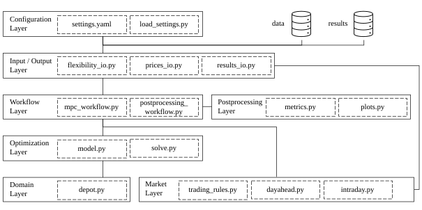

# FLEX-DEPOT

FLEX-DEPOT is a Python project for optimizing flexibility at a logistics depot incorporating electric trucks. It combines market
price series, flexibility power and energy bands, and market trading rules into a single rolling-horizon optimization (MPC). 
The core of the project is a MILP/LP (depending on settings) [Pyomo](https://pyomo.readthedocs.io/en/stable/) model that decides market
positions and physical power flow between depot and public grid while respecting aggregated asset power and energy flexibility bounds and gate-closure rules.

Key capabilities:
- Unified optimization for DA/ID (and optional imbalance) markets. Ready to implement other markets.
- Rolling-horizon MPC that commits market positions when gate closure is reached.
- CSV-based I/O for prices, mobility bounds, and results.
- Plotly-based visualization of dispatch, prices, and cashflows.

## Created by
Marcel Brödel, M.Sc.  
Institute of Automotive Technology  
Department of Mobility Systems Engineering  
TUM School of Engineering and Design  
Technical University of Munich  
[marcel.broedel@tum.de](mailto:marcel.broedel@tum.de)

## Licensing
FLEX-DEPOT is licensed under the [Apache 2.0](https://www.apache.org/licenses/LICENSE-2.0) open source license.  
The full license text can be found in the LICENSE file in the root directory of the repository.

## Related Publications
Brödel, M., Park, W.-H., Rosner, P., Lienkamp, M.: "FLEX-DEPOT: An open-source framework for multi-market flexibility commercialization of a logistics depot incorporating electric trucks."  
Manuscript under review at Energy Informatics, Springer Nature (2026)

## Repository Architecture

## Module Description
`Configuration Layer` specifies all scenario settings, including simulation horizons, enabled markets, optimization options, and asset parameters, serving as the single entry point.

`Input/Output Layer` manages the ingestion, alignment, and validation of external time series data, such as market prices and depot-based flexibility bands, as well as the structured export of results.

`Workflow Layer` coordinates execution across time and market stages, handling repeated optimizations, market gate closures, and progressive commitment of decisions.

`Optimization Layer` contains the mathematical formulation and solver interface that convert aggregated flexibility into market positions and operational schedules under market and physical constraints.

`Domain Layer` includes domain (depot)-specific abstractions.

`Market Layer` defines market and trading rules such as gate-closures.

`Postprocessing Layer` includes result summary generation and plotting script.

## Installation