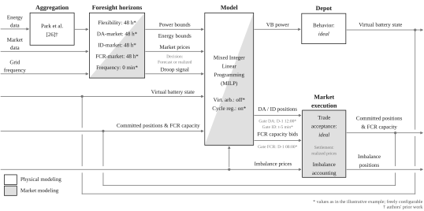

# FLEX-DEPOT

FLEX-DEPOT is a Python project for optimizing flexibility at a logistics depot incorporating electric trucks. It combines market
price series, flexibility power and energy bands, and market trading rules into a single rolling-horizon optimization (MPC). 
The core of the project is a MILP/LP (depending on settings) [Pyomo](https://pyomo.readthedocs.io/en/stable/) model that decides market
positions and physical power flow between depot and public grid while respecting aggregated asset power and energy flexibility bounds and gate-closure rules.

Key capabilities:
- Unified optimization for DA/ID spot markets. Ready to implement other markets.
- (Optional) second optimization run with imbalance activated to ensure feasiblity.
- Rolling-horizon MPC that commits market positions when gate closure is reached.
- CSV-based I/O for prices, flexibility bounds, and results.
- Plotly-based visualization of dispatch, prices, and cashflows.

## Created by
Marcel Brödel, M.Sc. <br>
Institute of Automotive Technology <br>
Department of Mobility Systems Engineering <br>
TUM School of Engineering and Design <br>
Technical University of Munich <br>
[marcel.broedel@tum.de](mailto:marcel.broedel@tum.de)

## Licensing
FLEX-DEPOT is licensed under the [Apache 2.0](https://www.apache.org/licenses/LICENSE-2.0) open source license. <br>
The full license text can be found in the LICENSE file in the root directory of the repository.

## Related Publications
Brödel, M., Park, W.-H., Rosner, P., Lienkamp, M.: "FLEX-DEPOT: An open-source framework for multi-market flexibility commercialization of a logistics depot incorporating electric trucks." <br>
Manuscript under review at Energy Informatics, Springer Nature (2026)

## Citation
If you use FLEX-DEPOT in academic work, please cite **both**:
1. The FLEX-DEPOT software repository
2. The associated publication

**Software:**
Brödel, M. (2026). FLEX-DEPOT (Version 1.0.0). GitHub repository.  
https://github.com/TUMFTM/flex-depot

**Publication:**
Brödel, M., Park, W.-H., Rosner, P., Lienkamp, M.  
*FLEX-DEPOT: An open-source framework for multi-market flexibility commercialization of a logistics depot incorporating electric trucks.*  
Energy Informatics, 2026 (under review).

Citation metadata is provided in `CITATION.cff`.

## Repository Architecture


## Module Description
`Configuration Layer` specifies all scenario settings, including simulation horizons, enabled markets, optimization options, and asset parameters, serving as the single entry point.

`Input/Output Layer` manages the ingestion, alignment, and validation of external time series data, such as market prices and depot-based flexibility bands, as well as the structured export of results.

`Workflow Layer` coordinates execution across time and market stages, handling repeated optimizations, market gate closures, and progressive commitment of decisions.

`Optimization Layer` contains the mathematical formulation and solver interface that convert aggregated flexibility into market positions and operational schedules under market and physical constraints.

`Domain Layer` includes domain (depot)-specific abstractions.

`Market Layer` defines market and trading rules such as gate-closures.

`Postprocessing Layer` includes result summary generation and a plotting script.

## Control Workflow


## Installation
### 1) Clone repository
FLEX-DEPOT is available at the institute's [GitHub](https://github.com/TUMFTM) and can be cloned from there using
```
git clone https://github.com/TUMFTM/flex-depot
```

### 2) Create and activate a virtual environment
It is recommended to create and activate a clean virtual environment for the installation. For Windows (PowerShell) this can be done by the following command:
```
py -m venv <name_of_virtual_environment>
.\<name_of_virtual_environment>\Scripts\activate
```
For example to create a virtual environment in the local `.venv/` directory:
```
py -m venv .venv
.\.venv\Scripts\activate
```

### 3) Install the package
Navigate to the root directory of the cloned repository and install the package and its dependencies using pip:
```
cd <root_directory>
python -m pip install --upgrade pip
pip install -e .
```

### 4) Solver
FLEX-DEPOT uses the [Pyomo](https://pyomo.readthedocs.io/en/stable/) compatible MILP solver [Gurobi](https://www.gurobi.com/solutions/gurobi-optimizer/). The open-source [cbc](https://github.com/coin-or) solver works well. The proprietary Gurobi solver is recommended however, as it is faster in execution, especially for large problems and offers a free academic license.
For Gurobi, install the Python bindings:
```
pip install gurobipy==<your_gurobi_version>
```
Verify that your Gurobi version and license version are the same:
```
pip show gurobipy
grbprobe
```
Verify that Pyomo can access Gurobi:
```
python -c "import pyomo.environ as pyo; print(pyo.SolverFactory('gurobi').available())"
```


### 5) Quick start (recommended): run the example batch file (Windows)
The repository includes a ready-to-run example script:
```
./run_example.bat
```
This will run the example configuration and generate result files in the results/ directory.


## How to use
FLEX-DEPOT uses two terminal commands, defined in ```cli.py```: 
1. Running the simulation by ```python -m flex_dep_opt run-sim --config <settings.yaml_file_path>```
2. Running the postprocessing by ```python -m flex_dep_opt run-post --config <settings.yaml_file_path>``` <br>

For sequential running of simulation and postprocessing, a batch file can be created and run, similar to ```run_example.bat```. <br>
Within the YAML file all parameters for a simulation run can be set: 

Simulation settings:

| Parameter                     | Type   | Description                                                | Valid values / format    |
|------------------------------|--------|------------------------------------------------------------|--------------------------|
| simulation.start             | str    | Simulation start time (inclusive)                          | YYYY-MM-DD HH:MM         |
| simulation.end               | str    | Simulation end time (inclusive)                            | YYYY-MM-DD HH:MM         |
| simulation.timestep_hours    | float  | Simulation timestep in hours                               | 0.25 (others not tested) |
| simulation.name              | str    | Identifier used for naming result files                    | arbitrary string         |
| simulation.solver            | str    | Optimization solver backend                                | {gurobi, cbc}            |

Market configuration: 

| Parameter                                           | Type   | Description                                             | Valid values / format |
|----------------------------------------------------|--------|---------------------------------------------------------|-----------------------|
| optimization.markets.dayahead.enabled              | bool   | Enable day-ahead market participation                   | true / false          |
| optimization.markets.dayahead.source               | str    | CSV file with day-ahead price time series               | path to CSV           |
| optimization.markets.dayahead.fee_eur_per_kwh      | float  | Transaction fee applied to day-ahead trades             | ≥ 0 (€/kWh)           |
| optimization.markets.intraday.enabled              | bool   | Enable intraday market participation                    | true / false          |
| optimization.markets.intraday.source               | str    | CSV file with intraday price time series                | path to CSV           |
| optimization.markets.intraday.fee_eur_per_kwh      | float  | Transaction fee applied to intraday trades              | ≥ 0 (€/kWh)           |

Trading rules: 

| Parameter                                                     | Type   | Description                                              | Valid values / format |
|--------------------------------------------------------------|--------|----------------------------------------------------------|-----------------------|
| optimization.trading.mode                                   | str    | Trading mode controlling market interaction realism      | {none, realistic}    |
| optimization.trading.dayahead.gate_closure_hour             | str    | Day-ahead gate closure time                              | HH:MM                |
| optimization.trading.dayahead.closes_previous_day           | bool   | Whether DA closes on day D-1                              | true / false         |
| optimization.trading.intraday.offset_minutes_before_delivery| int    | Intraday trading offset before delivery                  | ≥ 0 (minutes)        |

Imbalance settlement:

| Parameter                                                      | Type   | Description                                              | Valid values / format |
|---------------------------------------------------------------|--------|----------------------------------------------------------|-----------------------|
| optimization.imbalance.enabled                                | bool   | Enable imbalance settlement as fallback                  | true / false         |
| optimization.imbalance.only_on_infeasible                     | bool   | Activate imbalance only if no feasible schedule exists   | true / false         |
| optimization.imbalance.source_pos                             | str    | CSV file with positive imbalance prices                  | path to CSV          |
| optimization.imbalance.source_neg                             | str    | CSV file with negative imbalance prices                  | path to CSV          |
| optimization.imbalance.imbalance_volume_penalty_eur_per_kwh   | float  | Penalty on imbalance energy to discourage usage          | ≥ 0 (€/kWh)          |

Optimization logic:

| Parameter                                   | Type   | Description                                             | Valid values / format |
|--------------------------------------------|--------|---------------------------------------------------------|-----------------------|
| optimization.virtual_arbitrage             | bool   | Allow offsetting buy/sell across markets                | true / false         |
| optimization.mpc.da_horizon_hours          | int    | MPC prediction horizon for day-ahead optimization       | ≥ 1 (hours)          |
| optimization.mpc.id_horizon_hours          | int    | MPC prediction horizon for intraday optimization        | ≥ 1 (hours)          |
| optimization.mpc.terminal_condition        | bool   | Enable soft terminal energy condition                   | true / false         |
| optimization.mpc.terminal_weight_eur_per_kwh | float | Weight for terminal energy deviation penalty            | ≥ 0 (€/kWh)          |

Flexibility inputs: 

| Parameter                                                        | Type   | Description                                              | Valid values / format |
|-----------------------------------------------------------------|--------|----------------------------------------------------------|-----------------------|
| optimization.flexibility.bounds_file                            | str    | CSV file with aggregated power and energy flexibility bands | path to CSV       |
| optimization.flexibility.cycle_regularization.enabled           | bool   | Enable cycling regularization                            | true / false         |
| optimization.flexibility.cycle_regularization.cost_eur_per_kwh_throughput | float | Cost per charged/discharged energy throughput | ≥ 0 (€/kWh) |

Depot settings (only if desired, in addition to settings that are implicitly in flexibility bands)

| Parameter                                | Type   | Description                                         | Valid values / format |
|-----------------------------------------|--------|-----------------------------------------------------|-----------------------|
| optimization.depot.eta_grid2depot       | float  | Efficiency for grid-to-depot power flow             | (0, 1]                |
| optimization.depot.eta_depot2grid       | float  | Efficiency for depot-to-grid power flow             | (0, 1]                |
| optimization.depot.grid_connection_limit| float  | Symmetric grid connection limit                     | ≥ 0 (kW)              |
